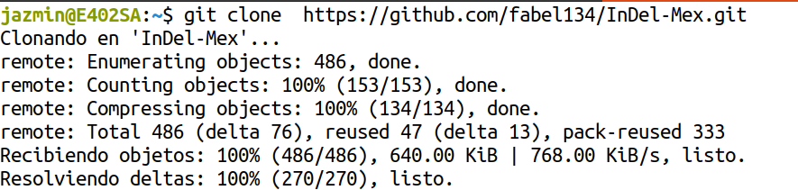
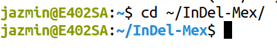
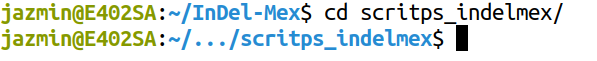
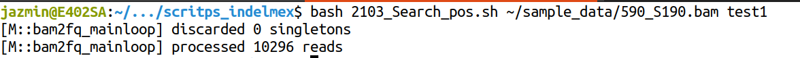
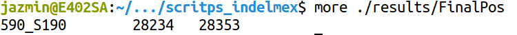
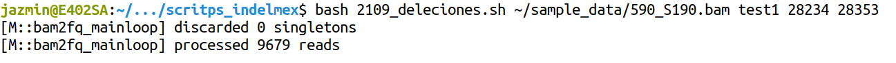
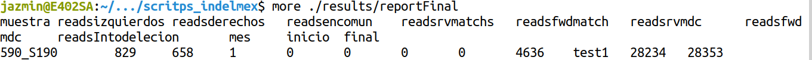

# Tutorial básico para correr los scripts en bash

## Cloning the repository
1. `cd ~
2. `git clone https://github.com/fabel134/InDel-Mex.git`   

3. `cd ~/InDel-Mex`  

## Sample data 
To try this program, you can download the sample data folder from this [link](https://drive.google.com/file/d/1XtVuEIJ16FRA2yQPG--L3g0dKYV3OQRE/view?usp=sharing).

## Running the program 
1. Once we're located in the project folder (i.e **InDel-Mex**), we move to the folder **scripts_indelmex**, we achieve this by typing `cd scritps_indelmex/`  

2. After that, we run the file **2103_Search_pos.sh** to search the position of a possible deletion. To run it we type `bash 2103_Search_pos.sh path_to_bam_file/bam_file.bam month` where *path_to_bam_file* is the path to the folder where is located the *bam_file.bam* to analyse and _month_ is a simple string.

3. Once we ran the file to search the positions, we can check the results by typing `more ./results/FinalPos`, it will show 3 columns: *file name*, *initial position* and *final position* for the possible deletion.

4.  The next step is run the file **2109_deleciones.sh**, to run it we simple type `bash 2109_deleciones.sh path_to_bam_file/bam_file.bam monthpi pf` where *path_to_bam_file* is the path to the folder where is located the *bam_file.bam* to analyse, _month_ is a simple string, *pi* is the initial position for the possible deletion (found in the previous step) and *pf* is the final position for the possible deletion (also found in the previos step).

5. Finally we type `more ./results/reportFinal` to check the summary.

